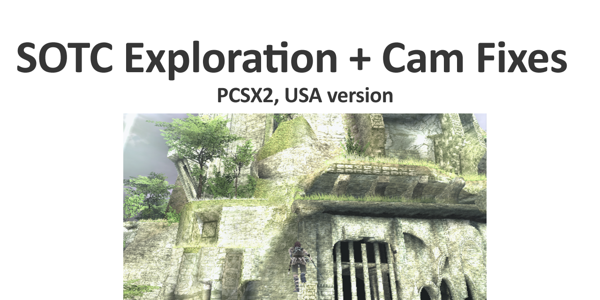

# Shadow Of the Colossus (USA) - Exploration Tools + Camera Fixes

Fixes:

- Centers the camera horizontally
- Fixes the default camera height + pitch
- Disables camera auto-return

Exploration:

- L1 = Hover/Walk + Speedhack ( when walking, not riding )
- R2 = Go through walls
= L2 (hold) + R1(tap) = rocket jump/climb

Random:
(uncomment them in the pnach)
- Parachute
- Debug menu
- Infinite Grip
etc

The new assembly is properly documented in the pnach comments!

Instructions:
- c:\users\<you>\Documents\PCSX2\cheats\C19A374E.pnach
- pcsx2

